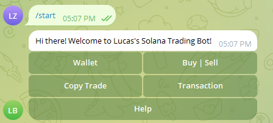
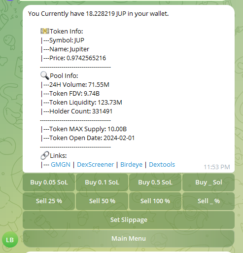

# Solana Telegram Swap Bot

<p align="center">
    
    
    <br>
    
    
    <br>
    
    
    <br>
</p>

## 📖 Description
This project hosts a Telegram bot that enables users to trade cryptocurrencies directly within Telegram chats. The bot processes user commands for trading and provides a seamless crypto trading experience. The motivation behind this project is to deepen understanding of blockchain technology and cryptocurrencies while providing a practical tool to engage with the market. Additionally, the project aims to explore new features such as follow trading and monitoring wallet transactions, blending learning with the potential to earn through crypto trading.

# ⚠️ Disclaimer
**Please note that I'm not responsible for any loss of funds, damages, or other libailities resulting from the use of this software or any associated services.<br>
This tool is provided for educational purposes only and should not be used as financial advice, it is still in expiremental phase so use it at your own risk.**


## 🛠️ Installation

1. **Node Endpoint Setup:**
   - Visit [QuickNode](https://www.quicknode.com) to obtain your node endpoints.
   - Place your endpoints in the `config.py` file.

2. **Telegram Bot Token:**
   - Create a Telegram bot via [BotFather](https://t.me/BotFather) and obtain a bot token.
   - Insert your bot token into the `config.py` file.

3. **Dependencies Installation:**
   - Install all required dependencies using the following command:
     ```
     pip install -r requirements.txt
     ```

## 🔬 Usage

Run the bot with the following command:
```
python main.py
```

## ✨ Features

- **Buy Token**: Purchase cryptocurrencies.
- **Sell Token**: Sell your cryptocurrencies.
- **Check Balance**: View your current balance.
- **Check Token Info**: Get detailed information about specific tokens.

## 📝 TO-DO
- [ ] Add Copy trade
- [ ] Monitor Transactions
- [ ] Improve Transaction Speed and Success Rate


## 📸 Screenshots 

<p align="center">
    
    
</p>


## 🤝 Contributing

Contributions are welcome! If you're interested in improving the bot, consider tackling items from the to-do list or suggesting new features. Here’s how you can contribute:

- **Copy Trade**: Implement functionality to allow users to copy trades of seasoned traders.
- **Monitor Transactions**: Develop features to monitor and notify users about wallet transactions.
- **Improve Transaction Speed and Success Rate**: Enhance the bot's efficiency and reliability in executing trades.

To contribute, please send pull requests to our GitHub repository.

## ✨ Credits

This project uses components from:
- [Jupiter Python CLI](https://github.com/0xTaoDev/jupiter-python-cli)
- [Jupiter Python SDK](https://github.com/0xTaoDev/jupiter-python-sdk)

## 🧾 License

This project is licensed under the MIT license. Feel free to edit and distribute this template as you like.<br>
See [LICENSE](LICENSE) for more information.